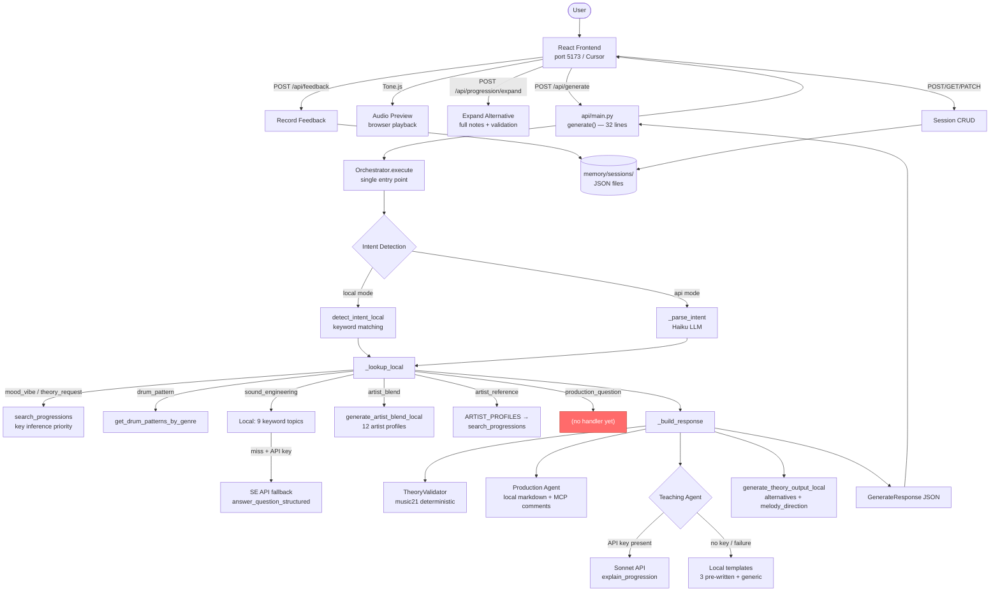

# Architecture — Music Co-Pilot

*Generated: 2026-04-08 — Phase 0 Onboarding*
*Last updated: 2026-04-08 — B+ Orchestrator consolidation complete*

---

## System Overview

A multi-agent music production assistant. User enters a natural-language prompt in a React frontend, which calls a FastAPI backend. The backend detects intent, routes to local (deterministic) or API (LLM-powered) agents, validates theory output with music21, and returns structured JSON consumed by the frontend.

Two operating modes:
- **Local mode** (`use_api: false`): Keyword intent detection, curated local databases. Teaching Agent calls Sonnet API when `ANTHROPIC_API_KEY` is set (quality decision — graceful degrade to local templates if no key). SE Agent falls back to API for unrecognized topics. Default for development and demo.
- **API mode** (`use_api: true`): Haiku for intent detection, Sonnet for all creative agents. Costs money per request.

---

## Current State Diagram

### Key data flows

| Flow | Path | Data shape |
|------|------|------------|
| Generate (local) | Frontend → API → keyword detect → local lookups → local agents → response | `GenerateResponse` JSON |
| Generate (API) | Frontend → API → Orchestrator (Haiku) → local lookups → LLM agents (Sonnet) → response | `GenerateResponse` JSON |
| Expand alternative | Frontend → `/api/progression/expand` → chord resolution + music21 validation | `ExpandProgressionResponse` JSON |
| Feedback | Frontend → `/api/feedback` → SessionManager → JSON file | `{success, feedback, swap_label}` |
| Session CRUD | Frontend → `/api/session` endpoints → SessionManager → JSON file | `SessionResponse` JSON |

---

## Agent Inventory — Four Questions Each

### 1. Orchestrator (`agents/orchestrator.py`)

**1. What does it expect to receive?**
- `user_input: str` — the raw user prompt
- `session_history: Optional[List[Dict]]` — previous interactions (currently unused)
- Requires `ANTHROPIC_API_KEY` env var for Haiku LLM calls

**2. What does it guarantee to return?**
- `OrchestratorResult` dataclass: `{success, intent: ParsedIntent, routing: RoutingPlan, local_data: Optional[Dict], agent_outputs: Dict, clarification_needed, clarification_question, token_summary, error}`
- `intent` always has `intent_type` (IntentType enum) and `confidence` (float)
- `routing.agents` is a list of agent names to invoke (but see gap below)
- `local_data` is populated if `routing.use_local_lookup` is True and matches found

**3. What does it do if something is missing?**
- If JSON parse fails on Haiku response: returns `IntentType.UNKNOWN` with confidence 0.0
- If no moods/genres extracted: local lookup returns `None`
- If API key missing: `Anthropic()` constructor will raise (no graceful fallback)

**4. How does the next agent depend on this output?**
- `api/main.py` reads `intent.intent_type`, `intent.confidence`, `intent.extracted`, `local_data`, `token_summary`, `clarification_needed`
- **GAP**: `routing.agents` list is never consumed. api/main.py does its own inline routing.
- **GAP**: `agent_outputs` dict is never populated or read.

---

### 2. Theory Agent (`agents/theory_agent.py`)

**1. What does it expect to receive?**
- **API mode** `generate()`: `intent_data: Dict` with optional keys `moods`, `genres`, `key`, `tempo`, `artist`, `specific_request`; `user_level: str`
- **Local mode** `generate_theory_output_local()`: `progressions: List[Dict]` where each has `name`, `numerals`, `key`, `chords`, `moods`, `genres`; `intent_data: Optional[Dict]`
- **Artist blend** `generate_artist_blend_local()`: two artist name strings matching keys in `ARTIST_PROFILES`

**2. What does it guarantee to return?**
- **API mode**: parsed JSON dict matching the Theory Agent output contract, or `{"error": "Failed to parse theory output"}` on parse failure
- **Local mode**: `{primary: Dict, alternatives: List[Dict], melody_direction: Dict}` or `{}` if no progressions
- **Artist blend**: `{artist_blend: Dict, progression: Optional[Dict], key_type, tempo_range, moods}` or `None` if artist not in profiles

**3. What does it do if something is missing?**
- Local mode: `_generate_melody_direction_local` uses `.get()` with defaults for all fields. `scale_fifths` map only covers natural notes — sharps/flats (e.g., C#, Bb) fall through to default "E4"
- API mode: if no moods/genres/key/tempo/artist/specific provided, defaults to "Something interesting and melancholic in a minor key"
- `generate_theory_output_local` creates a `TheoryAgent` via `__new__` (skips `__init__`), only sets `tracker=None`

**4. How does the next agent depend on this output?**
- `api/main.py` reads `alternatives` and `melody_direction` from the return value
- Alternatives are normalized by `_normalize_alternatives_for_api()` (underscores → spaces in labels, string chords → `{name, numeral}` objects)
- Frontend `normalize.js` passes `melody_direction` directly to `MelodyDirectionPanel`
- Frontend `sessionStages.js` checks `melody_direction` object presence to advance the `melodyDir` stage

---

### 3. Theory Validator (`validator/theory_validator.py`)

**1. What does it expect to receive?**
- `progression_data: Dict` with `key: str` (e.g., "A minor"), `scale: str` (optional, defaults "major"), `chords: List[Dict]` where each chord has `numeral`, `name`, `notes: List[str]` (e.g., `["A3", "C4", "E4"]`)

**2. What does it guarantee to return?**
- `ValidationResult` dataclass: `{passed: bool, errors: List[str], warnings: List[str], info: List[str], issues: List[ValidationIssue], corrected_output: Optional[Dict]}`
- `.to_dict()` returns `{passed, errors, warnings, corrected_output}`
- `passed` starts `True` and flips to `False` on any ERROR-severity issue

**3. What does it do if something is missing?**
- No chords: adds `NO_CHORDS` error, returns immediately
- Invalid key string: adds `INVALID_KEY` error, returns immediately
- Invalid note string: adds `INVALID_NOTE` error per note, continues validation
- Chord parse failure: adds `CHORD_PARSE_ERROR` warning, continues
- Uses `pitch.Pitch(name).ps` for enharmonic comparison (avoids Bb vs B- string mismatch)

**4. How does the next agent depend on this output?**
- `api/main.py` calls `.to_dict()` and stores in `response_data["validation"]`
- Frontend extracts `validation.warnings` as `voice_leading_notes` display
- Frontend shows pass/fail badge based on `validation.passed`
- **Note**: `corrected_output` is always `None` — the correction loop described in CLAUDE.md (Theory Agent → Validator → retry up to 2x) is not implemented

---

### 4. Production Agent (`agents/production_agent.py`)

**1. What does it expect to receive?**
- **API mode** `generate_from_local_data()`: `local_data: Dict` with `progressions` and/or `drum_patterns` lists; `user_level: str`
- **Local standalone** `generate_chord_instructions_local()`: `prog: Dict` with `key`, `chords` (list with `name`, `numeral`, `note_names`), `tempo_range`/`tempo_suggestion`
- **Local standalone** `generate_drum_instructions_local()`: `pattern: Dict` with `name`, `tempo_range`, `grid` (dict of sound → step arrays)

**2. What does it guarantee to return?**
- **API mode**: `{chord_instructions: {markdown, daw, progression_data}, drum_instructions: {markdown, daw, pattern_data}}` — keys present only if corresponding input exists
- **Local standalone**: markdown string directly
- All markdown includes `# MCP v2:` comments for future Ableton MCP integration

**3. What does it do if something is missing?**
- `generate_from_local_data()` returns `{}` if neither progressions nor drum_patterns present
- All field access uses `.get()` with defaults: key→"C major", tempo→"120 BPM", chords→[]
- `daw_target` parameter exists (default "ableton") but is never set to anything else

**4. How does the next agent depend on this output?**
- **API path**: `api/main.py` extracts `production_result["chord_instructions"]["markdown"]` → `response_data["production_steps"]`
- **Local path**: `api/main.py` calls standalone functions directly, result goes to `response_data["production_steps"]`
- Frontend passes `production_steps` as `productionMarkdown` to the production panel
- Only the `markdown` field is consumed — `daw` and original data are discarded

---

### 5. Teaching Agent (`agents/teaching_agent.py`)

**1. What does it expect to receive?**
- **API mode** `explain_from_local_data()`: `local_data: Dict` with `progressions` and/or `drum_patterns`; `user_level`, `detail_level`
- **Local standalone** `generate_progression_explanation_local()`: `progression_data: Dict` with `name`, `numerals`, `key`, `moods`, `description`
- **Local standalone** `generate_rhythm_explanation_local()`: `pattern_data: Dict` with `name`, `description`, `swing`, `grid`, `tempo_range`

**2. What does it guarantee to return?**
- **API mode**: `{progression_explanation: {explanation, progression, detail_level}, rhythm_explanation: {pattern, explanation}}` — keys present only if corresponding input exists
- **Local standalone**: markdown string directly
- Pre-written explanations exist for 3 named progressions: `epic_minor`, `sad_lo-fi`, `andalusian`. All others get a generic template.

**3. What does it do if something is missing?**
- `explain_from_local_data()` returns `{}` if no progressions or drum_patterns
- Rhythm explanation uses heuristics on grid data: checks for four-on-the-floor, half-time, driving, or sparse feel
- If progression name doesn't match pre-written explanations, generates a generic template from numerals and moods

**4. How does the next agent depend on this output?**
- **API path**: `api/main.py` extracts `teaching_result["progression_explanation"]["explanation"]` → `response_data["teaching_note"]`
- **Local path**: standalone functions return markdown directly → `response_data["teaching_note"]`
- Frontend displays in the teaching panel. `sessionStages.js` does not track teaching note for stage advancement.
- Teaching Agent adaptation (shorten if user skips) is specced in `session.py` (`skips_explanations`, `asks_followups` fields) but never wired to the agent

---

### 6. Sound Engineering Agent (`agents/sound_engineering_agent.py`)

**1. What does it expect to receive?**
- **API mode** `answer_question()`: `question: str`, `user_level: str`, `context: Optional[Dict]` with optional `key`, `genre`, `bpm`
- **Local mode** `generate_sound_engineering_local()`: `question: str`

**2. What does it guarantee to return?**
- **API mode**: `{markdown: str, question: str}`
- **Local mode**: `{summary, steps, ableton_path, principle, artist_reference}` or `None` if no keyword match
- **RED FLAG: Return shapes differ between local and API mode.** Local returns a structured dict with 5 specific fields. API returns a dict with `markdown` and `question`. The frontend and api/main.py handle both, but the contract is inconsistent.

**3. What does it do if something is missing?**
- Local mode: iterates `_KEYWORD_TO_TOPIC` map. Returns `None` if no keyword matches. Covers 9 topics (sidechain, eq, compress, reverb, automate, filter, bass, kick, synthesis).
- API mode: always returns a response (LLM answers anything). Selectively loads grounding docs based on question keywords (automation, artist, mixing).
- Grounding docs truncated at 5000 chars with `[... truncated for context ...]` appended.

**4. How does the next agent depend on this output?**
- `api/main.py` stores local result directly in `response_data["sound_engineering_response"]`
- Frontend `App.jsx` checks `typeof sound_engineering_response === 'object'` to conditionally render `SoundEngineeringPanel`
- `SoundEngineeringPanel` component consumes the local-mode shape (`summary`, `steps`, etc.)
- **If API mode were used, the frontend would receive `{markdown, question}` which SoundEngineeringPanel does not expect** — this path is currently not reachable because SE questions always go through local mode in the current api/main.py flow

---

### 7. Session Manager (`memory/session.py`)

**1. What does it expect to receive?**
- `create_session()`: `user_profile: UserProfile`, `project_context: ProjectContext`, `session_mode: Optional[str]`
- `add_to_history()`: `session: Session`, `request: str`, `intent_type: str`, `output: Dict`
- `record_feedback()`: `session: Session`, `entry_index: int`, `feedback: str`, `feedback_label: Optional[str]`
- `update_project_context()`: `session: Session`, plus optional `key`, `bpm`, `genre`, `name`

**2. What does it guarantee to return?**
- `create_session()`: `Session` object, saved to JSON file immediately
- `load_session()`: `Optional[Session]` — returns `None` if file doesn't exist or JSON is corrupt
- `list_sessions()`: `List[Dict]` sorted by `updated_at` descending
- `record_feedback()`: `bool` — `False` if entry_index out of range

**3. What does it do if something is missing?**
- `get_or_create_session(manager, session_id)`: if `session_id` is None or session not found, creates a new session with default profile
- `load_session()`: catches `json.JSONDecodeError` and `FileNotFoundError`, returns `None`
- `_update_profile_from_feedback()`: checks last 10 history entries for feedback patterns

**4. How does the next agent depend on this output?**
- `api/main.py` uses `session.user_profile.production_level` and `session.user_profile.theory_level` to set agent user_level parameters
- `session.session_id` is returned in every `GenerateResponse`
- Frontend tracks `sessionId` and passes it on subsequent requests
- History is written but never read back to influence generation (v2 feature)

---

## Assessment

*Updated 2026-04-08 after B+ Orchestrator consolidation.*

**What's working:** The Orchestrator is now the single entry point for all requests. `api/main.py` `generate()` is 32 lines — session, execute, history, return. Intent detection, routing, local lookup, agent calls, and response assembly all live in the Orchestrator. Six intent types handled: mood_vibe, drum_pattern, sound_engineering, artist_blend, artist_reference, and theory_request. Teaching Agent calls Sonnet API when key is available (Approach C graceful degrade). SE Agent has unified structured contract and API fallback for unrecognized topics. Theory validation, Tone.js audio preview, and session persistence continue to work. All 7 curl verification tests pass.

**What's fragile:** Orchestrator file is 900+ lines — functional but large. Grounding documents are still silently truncated. The `use_api=true` path calls Haiku for intent detection but still falls through to the same local lookup path — full API-mode pipeline is not wired. The bare `except: pass` in `_enhance_with_api` is now `logger.warning` but the Teaching Agent API path in `_generate_teaching_note` catches errors individually.

**What's missing:** No automated test suite (BACKLOG #7 — highest priority for Phase 3). `production_question` intent still unhandled (BACKLOG #16). Theory Validator correction loop not implemented (BACKLOG #11). Teaching Agent adaptation not wired (BACKLOG #12). Clarification loop not built (BACKLOG #10). `_get_artist_reference` doesn't prioritize the user's named artist (BACKLOG #15).
