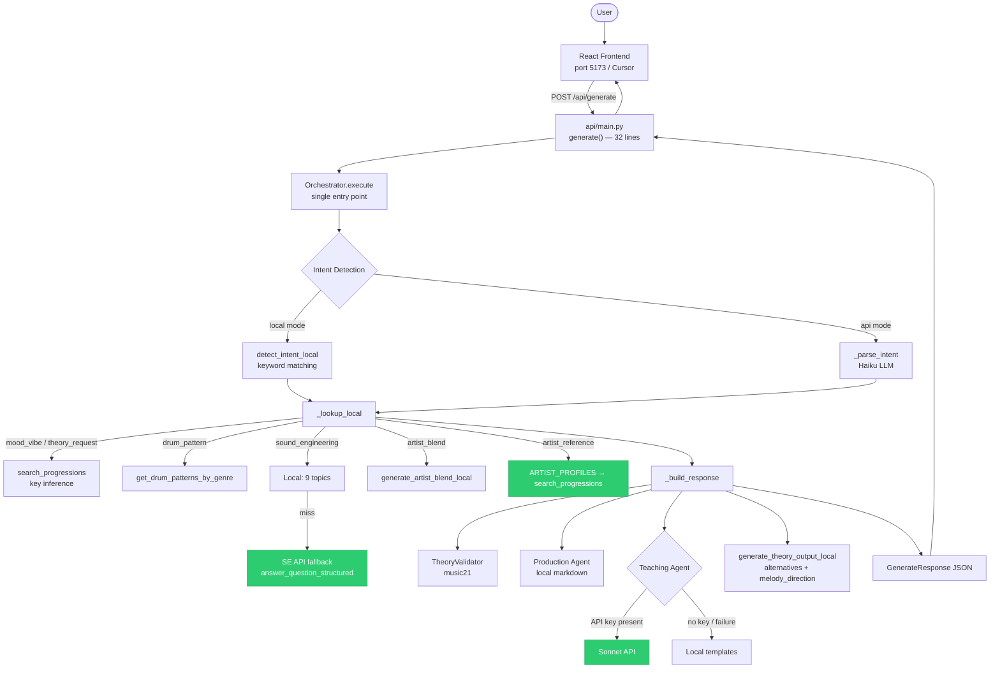

# Decision: Orchestrator consolidation (Option B+)

Date: 2026-04-08
Status: Decided
Commits: 44cac3e, 4816495, 4c47784, 82791a7

## Problem
Four interrelated architectural issues:

1. **Dual intent system** — `detect_intent_local()` in api/main.py and `Orchestrator._parse_intent()` did the same job with different intent type coverage. The Orchestrator's routing plan was built but never consumed.
2. **Inline orchestration** — api/main.py `generate()` was 315 lines of intent branching, local lookups, agent calls, and response assembly. Adding new intent types required editing this monolith.
3. **SE Agent contract mismatch** — Local mode returned `{summary, steps, ableton_path, principle, artist_reference}`. API mode returned `{markdown, question}`. Frontend only handled the local shape.
4. **Teaching Agent quality** — Local mode had 3 pre-written templates plus a generic fallback. Every other progression got a generic 6-line template.

## Options considered
| Option | Summary | Why not chosen |
|--------|---------|---------------|
| Option 1: Patch in place | Fix agents without restructuring generate() | Same quality improvement, but tech debt untouched — dual intent system remains, adding intent #8 still requires two edits |
| **Option 2: Consolidate (B+)** | Move all logic into Orchestrator, slim api/main.py to thin adapter | Chosen — fixes quality AND eliminates structural tech debt |
| Option 3: Pipeline architecture | Formal PipelineStep protocol, declarative routing | Over-engineered for 7-agent single-user system |

## Decision
Consolidate all intent detection, routing, lookup, and response assembly into the Orchestrator class. api/main.py becomes a 32-line thin adapter. Teaching Agent always calls Sonnet API when API key is available (Approach C: graceful degrade to local templates if no key). SE Agent gains a structured API mode (`answer_question_structured()`) and API fallback when local keyword matching returns None. Single-artist `artist_reference` intent now produces results.

Implemented as 4 sequential commits, each independently verifiable:
- **Commit A** (44cac3e): Move intent detection into Orchestrator. Lazy Anthropic client.
- **Commit B** (4816495): Move lookup and response assembly. generate() → 32 lines.
- **Commit C** (4c47784): Teaching Agent always-API + SE Agent contract fix.
- **Commit D** (82791a7): artist_reference handler + use_api docstring.

## Tradeoffs accepted
- **Teaching Agent requires API key for full quality.** Without key, degrades to local templates. Approach C logs the mode at startup so the developer knows.
- **`use_api` flag semantics changed.** `use_api=false` no longer means zero API calls — Teaching Agent and SE Agent may still call the API. Documented in GenerateRequest docstring.
- **Orchestrator file grew significantly.** From ~460 lines to ~900 lines. This is acceptable because it's now the single source of truth — no logic duplicated elsewhere.
- **`_get_artist_reference` in theory_agent.py matches by genre/mood overlap, not by the artist the user named.** "Something like Massive Attack" returns a dark minor progression but the melody direction may reference a different dark artist. This is existing behavior, not introduced by this change.

## Current state diagram

## Deferred
- Orchestrator does not yet run the process() → agent pipeline for `use_api=true`. The API path still uses process() for intent detection only, then falls through to the same local lookup + build response path. Full API-mode pipeline execution deferred.
- `_get_artist_reference` does not prioritize the user's named artist. BACKLOG item.
- `production_question` intent still has no local handler. BACKLOG item.
